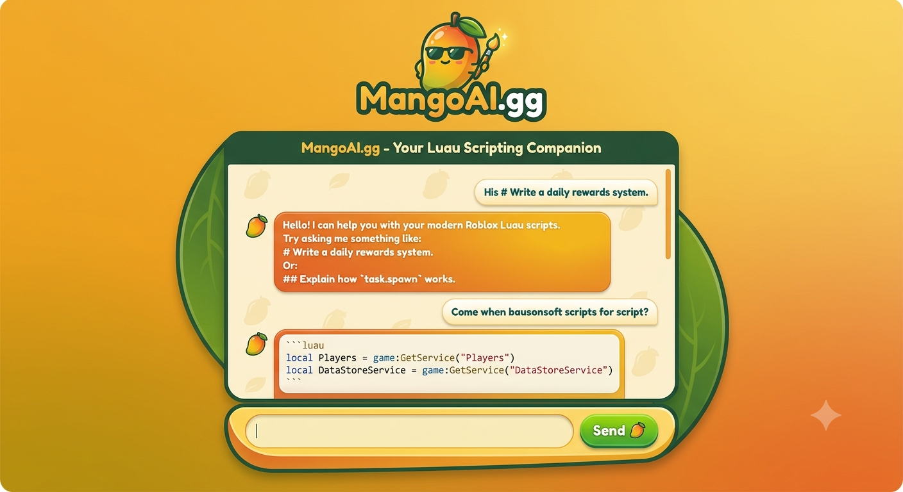

# 🥭 MangoAI.gg

**MangoAI.gg** is a lightweight, zero-configuration web assistant tailored for Roblox Luau developers. It leverages browser-based AI execution to eliminate the need for server hosting, API setup, or paid subscriptions.



## ✨ Key Features

* **Zero Setup & Free:** Uses `Puter.js` to run directly in your browser without requiring API key configuration.
* **Modern Luau Generation:** Optimized to produce code adhering to modern Roblox standards (`task.wait()`, `game:GetService()`, local scoping, DataStores).
* **Credit System & Authentication:** Starts users with 1,000 credits (50 credits per query) and unlocks infinite credits upon logging in.
* **Live Dashboard:** Monitors account status, credits, total scripts generated, and query history in real time.
* **Markdown & Special Character Support:** Formats headings (`#`, `##`, `###`) and provides code snippets with copy-to-clipboard functionality.

## 📁 File Structure

```text
├── index.html                           # Full single-page web app
├── README.md                            # GitHub repository documentation
└── watermarked_img_3248696173610090388.png  # Application preview asset
